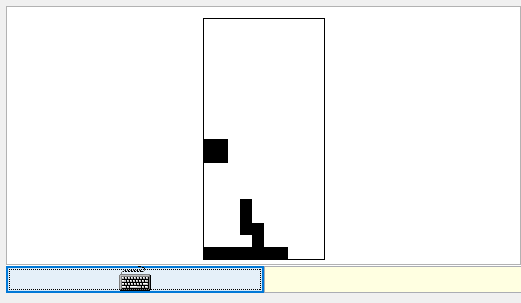
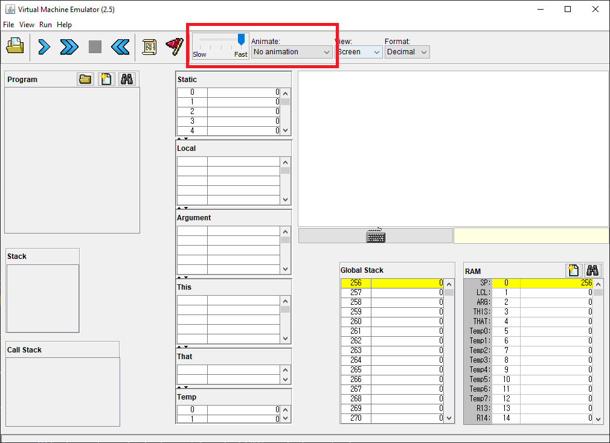
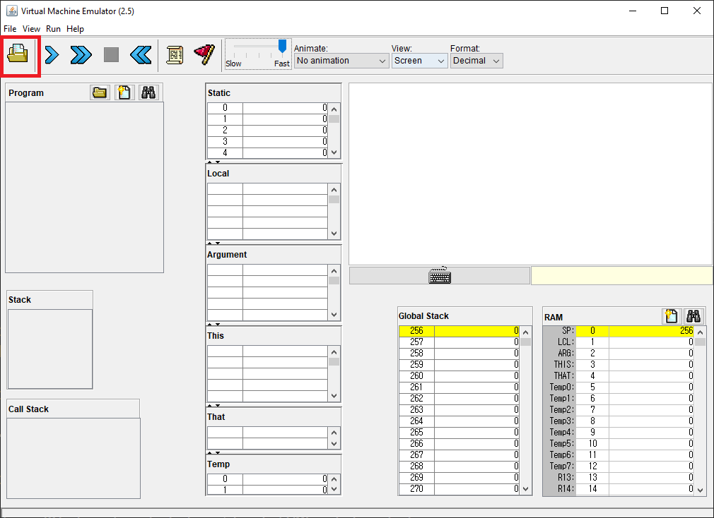
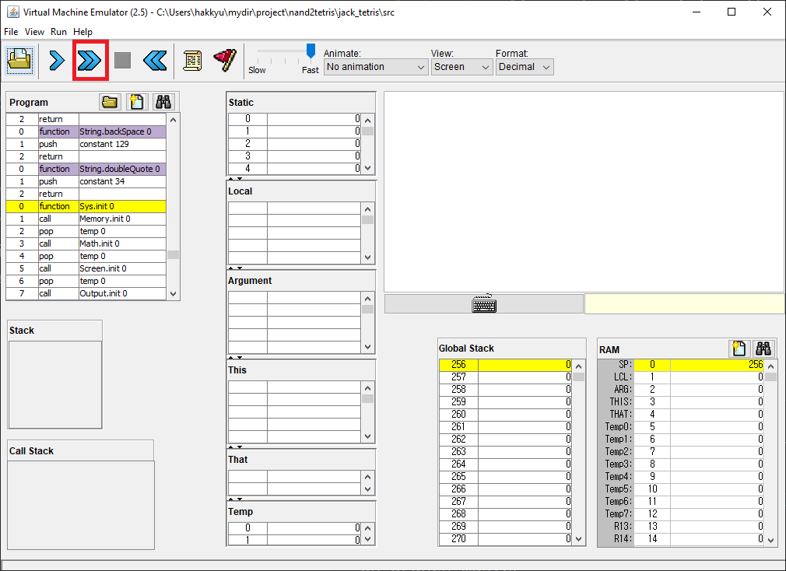

# Jack Tetris

This is a personal learning project that implements a simple tetris game using the Jack programming language introduced in the Coursera lecture: [Build a Modern Computer from First Principles" by Professor Shimon Schocken](https://www.coursera.org/learn/nand2tetris2/home/welcome).

The Jack Tetris game is programed using the Jack language, a minimal programming language designed for the lecture. The compiled Jack language produces an intermediate language called the "VM language". The VM Emulator runs the compiled VM code and displays the tetris game on it's screen.



## How to run

The Jack compiler and the VM Emulator is in the `tools` folder. They are utility programs from the lecture. I've left out the tools not used for this project. The full set of tools can be downloaded at the [lecture's homepage](https://www.nand2tetris.org/software).

1. Compile the Jack source code:

    ```sh
    # Compiling the Jack source codes in the src folder

    # on Windows
    tools\JackCompiler.bat src

    # on Linux
    tools/JackCompiler.sh src
    ```

2. Run on the VM Emulator

    1. Execute the VM Emulator

        ```sh
        # on Windows
        tools\VMEmulator.bat

        # on Linux
        tools\VMEmulator.sh
        ```

    2. Configure settings

        Set Animate to **NO animation** and drag the blue pin to **Fast**.

        

    3. Open the VM codes

        Click the folder icon on the top left corner, then open the `src` folder.

        

    4. Run the game

        Run the game by clicking the highlighted icon below:

        

## Some tips in Jack programming

Undefined operator precedence was the toughest bug to find. You easily overlook them because its very unnatural to add parentheses to operators in cases where, mathematically, they have the highest precedence. For example:

```java
if(x > y - 1){ // this is undefined!
    ...
}

// must do
if(x > (y - 1)){

}

// also..
let x = 3 + 4 * 7; // undefined

// must do
let x = 3 + (4 * 7);

```


